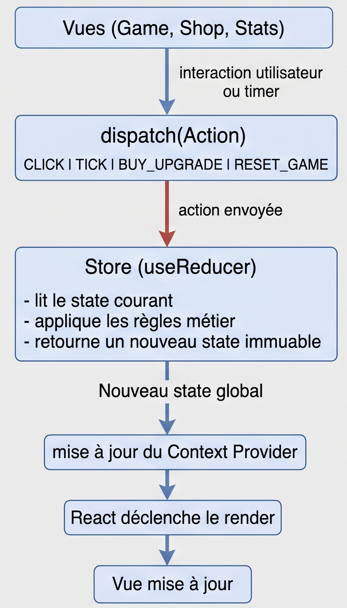

# Choix du SPA

React.

## Commandes

- Lancer l’application en local : npm run dev
- Générer le build de production : npm run build

## Rôle des dossiers dans `src`

- `src/assets` : contient les ressources statiques utilisées par l’application, comme les images, icônes, polices ou médias.
- `src/components` : regroupe les composants réutilisables de l’interface, pensés pour être partagés entre plusieurs pages.
- `src/pages` : contient les vues principales de l’application, c’est-à-dire les écrans accessibles par navigation.
- `src/services` : centralise les appels à des services externes, la logique de récupération de données et les interactions avec une API.
- `src/state` : rassemble l’état global ou partagé de l’application, ainsi que la logique de gestion associée.
- `src/styles` : regroupe les styles communs, les variables de thème et les feuilles de style globales.

## Point d’entrée de l’application

1. L’application est montée dans le DOM dans [src/main.tsx](src/main.tsx).
2. Le composant racine est [src/App.tsx](src/App.tsx), qui rend `<App />`.
3. Le router est configuré dans [src/App.tsx](src/App.tsx).
4. L’élément HTML servant de point d’ancrage est le `div` avec l’id `root` dans [index.html](index.html).

### Description des composants

- [src/pages/game.tsx](src/pages/game.tsx) : page du jeu et orchestration des états.
- [src/components/GameHeader.tsx](src/components/GameHeader.tsx) : affiche le titre, l’argent et le revenu/sec.
- [src/components/MoneyDisplay.tsx](src/components/MoneyDisplay.tsx) : affiche l’argent formaté.
- [src/components/ClickButton.tsx](src/components/ClickButton.tsx) : bouton qui ajoute de l’argent au clic.
- [src/utils/formatNumber.tsx](src/utils/formatNumber.tsx) : formatage `K`, `M`, `B`.

### Où se trouve le state

- Le state principal est `money` dans [src/pages/game.tsx](src/pages/game.tsx).
- Il est créé avec `useState(0)` dans la page.

### Comment remonte l’événement

1. [src/pages/game.tsx](src/pages/game.tsx) crée `handleClick` et met à jour `money`.
2. `handleClick` est passé en prop `onClick` à [src/components/ClickButton.tsx](src/components/ClickButton.tsx).
3. Au clic, le bouton appelle `onClick`.
4. `money` remonte dans [src/components/GameHeader.tsx](src/components/GameHeader.tsx) puis [src/components/MoneyDisplay.tsx](src/components/MoneyDisplay.tsx).

### Gestion du tick

- L’interval est créé dans [src/pages/Game.tsx](src/pages/Game.tsx) dans `useEffect`.
- Il ajoute `incomePerSecond` à `money` toutes les secondes.
- Il est nettoyé avec `window.clearInterval(intervalId)` au démontage.
- Si `incomePerSecond` change, l’ancien interval est remplacé.

Pourquoi c’est important :

- Un seul interval reste actif.
- Pas de doublon après navigation ou hot reload.
- Sinon le jeu accélère car plusieurs ticks s’additionnent.

### Preuve du bon fonctionnement

- Le log temporaire montre 1 message par seconde si l’interval est unique.
- Plusieurs logs par secondes permettent de vérifier si il y a un décalage
- Un interval mal géré accélère le jeu parce que chaque interval ajoute son propre tick.
- Le cleanup évite cette accumulation.

### Analyse Event Loop

1. `setInterval` ne met pas le code dans la Call stack directement : il enregistre un callback à exécuter plus tard.
2. Le callback attend d’abord dans les Web APIs du navigateur.
3. Quand le délai est atteint, il passe dans la Task queue (macrotask).
4. Il n’entre dans la Call stack que quand elle est libre.
5. Si le thread principal est occupé, le callback reste en attente.
6. Le timer peut donc être retardé par du rendu, du calcul ou d’autres tâches JavaScript.

## Observation du besoin de state global

1. `money` et `incomePerSecond` vivent dans [src/App.tsx](src/App.tsx), puis sont passés aux pages via des props.
2. Oui. [src/pages/game.tsx](src/pages/game.tsx) et [src/pages/shop.tsx](src/pages/shop.tsx) utilisent les mêmes données: argent, revenu/sec, et état des upgrades.
3. Les données sont partagées via le "lifting state up": état centralisé dans [src/App.tsx](src/App.tsx), callbacks passés aux pages (`onCollect`, `onBuyUpgrade`) et rendu piloté par props.
4. La solution devient fragile avec le prop drilling: beaucoup de props à faire transiter, couplage plus fort entre pages/composants, maintenance plus lourde quand on ajoute de nouvelles vues ou nouvelles stats partagées.

## Structure du state global

Le state global est défini dans [src/state/gameStore.tsx](src/state/gameStore.tsx).

Structure actuelle:

- `money` : argent disponible.
- `clickValue` : valeur gagnée à chaque clic.
- `incomePerSecond` : revenu automatique par seconde.
- `upgrades` : liste des upgrades avec leur compteur.
- `totalClicks` : nombre total de clics effectués.
- `totalEarned` : argent total généré par le tick.

## Liste des actions

Les actions sont définies dans [src/state/gameStore.tsx](src/state/gameStore.tsx).

- `CLICK` : augmente `money` de `clickValue` et incrémente `totalClicks`.
- `TICK` : ajoute `incomePerSecond` à `money` et incrémente `totalEarned`.
- `BUY_UPGRADE` : reçoit `upgradeId`, vérifie les fonds, décrémente `money`, incrémente `count`, met à jour `incomePerSecond`.
- `RESET_GAME` : remet le state à zéro.

## Où se trouve le tick

Le tick est déclenché dans [src/App.tsx](src/App.tsx) avec un `useEffect` qui envoie `dispatch({ type: "TICK" })` toutes les secondes.

Pourquoi ici:

- le tick est global et ne dépend pas de la page affichée;
- il continue même si l'utilisateur navigue vers Shop, Stats ou Settings;
- le state reste centralisé au même endroit.

## Schéma du flux unidirectionnel



## Justification de l’architecture choisie

L’application utilise `Context + reducer` parce que c’est une solution simple, adaptée à React, et suffisante pour un state partagé de petite taille.

- Lecture du state depuis un point unique via le store.
- Modifications uniquement via des actions.
- Flux unidirectionnel clair: vue -> action -> reducer -> nouveau state -> render.
- Moins de props à transmettre entre les pages et les composants.
- Plus facile à faire évoluer quand on ajoute de nouvelles statistiques ou de nouvelles actions.

## Vérifications manuelles

Tests à faire dans l’application:

1. Cliquer dans Game augmente `money` dans Game et dans la Navbar.
2. Acheter un upgrade dans Shop augmente `income/sec` dans Shop et dans la Navbar.
3. Rester sur Shop pendant plusieurs secondes: `money` continue d’augmenter grâce au tick global.
4. Passer de Game à Shop puis à Stats: les valeurs restent synchronisées partout.

## Analyse critique

1. Pourquoi ne pas sauvegarder à chaque tick sans throttle ?

Parce que ça ferait trop d'écritures dans `localStorage` et ça pourrait ralentir le jeu.

2. Que se passe-t-il si le JSON est corrompu ?

On l'ignore et on repart avec l'état par défaut pour éviter un crash.

3. À quoi sert `version` dans la sauvegarde ?

Elle permet de gérer les futures évolutions du format de sauvegarde.

4. Quelles données avez-vous choisi de sauvegarder, et pourquoi ?

On sauvegarde `money`, `clickValue`, `incomePerSecond`, `upgrades`, `totalClicks` et `totalEarned` pour retrouver la partie exactement comme elle était.

## TP 11 — Performance : Mesurer, Comprendre, Optimiser

Résumé des actions réalisées dans le dépôt pour le TP :

- **Instrumentation** : ajout d'un compteur de re-renders activable via l'URL `?renderLogs=1` pour `Navbar`, `Shop` et `UpgradeCard`.
- **Optimisation 1 (re-renders)** : `UpgradeCard` est maintenant enveloppé par `React.memo` avec un comparateur peu coûteux. Le `onBuy` envoyé aux cartes est une fonction stable (`useCallback`) et on passe `id` plutôt qu'une closure recréée.
- **Optimisation 2 (recherche + debounce)** : champ de recherche sur `/shop` avec debounce 300ms (réduit les filtres / re-renders lors de la frappe).
- **Optimisation 3 (code-splitting)** : pages `/shop` et `/stats` chargées à la demande via `React.lazy` + `Suspense`.

Comment reproduire les mesures (conseil pas-à-pas) :

1. Lancer l'app localement :

   ```bash
   npm install
   npm run dev
   ```

2. Baseline (avant optimisation) — _si vous voulez comparer, effectuez cette étape avant mes commits_ :
   - Ouvrir Chrome DevTools → Lighthouse (mode Navigation) → lancer pour `/` et `/shop` → capture des scores et métriques (FCP, LCP, TBT).
   - DevTools → Performance → enregistrez 5–10s sur `/shop` pendant que le tick tourne → observez long tasks, scripting/painting.
   - Pour compter les re-renders : ouvrez `/shop?renderLogs=1` puis observez la console (console.count affiche les re-renders par composant).

3. Mesures avec les optimisations appliquées (après ce commit) :
   - Ouvrir `/shop?renderLogs=1` et refaire les mêmes enregistrements Lighthouse / Performance.
   - Vérifier dans Network que les chunks `shop` et `stats` se chargent à la navigation (code-splitting).

Questions demandées (réponses succinctes) :

1. Qu’est-ce qui re-renderait “inutilement” avant optimisation ?

- La page `Shop` et ses `UpgradeCard` se re-rendaient à chaque tick parce que le `money` global changeait et que chaque carte recevait des props (notamment des fonctions) recréées à chaque rendu parent. Cela provoquait un grand nombre de renders inutiles des cartes qui n'avaient pas changé.

2. Quelles optimisations ont eu un impact réel ?

- `React.memo` sur `UpgradeCard` + envoi d'un handler `onBuy` stable réduit fortement les re-renders des cartes.
- Debounce sur la recherche évite les recalculs/filters à chaque frappe.
- Lazy-loading (`React.lazy`) allège le bundle initial et déplace le coût de chargement lors de la navigation.

3. Quelle optimisation vous semble la plus rentable ?

- Le `React.memo` + stabilité des handlers : souvent le meilleur rapport effort/impact pour des listes de composants réutilisables.

4. Pourquoi le tick est un bon révélateur de problèmes de perf ?

- Le tick actualise le state global toutes les secondes; il met en lumière les renders en cascade et les allocations/fonctions recréées à chaque rendu, montrant immédiatement les composants qui subissent des re-renders inutiles.

5. Quelles optimisations vous n’avez PAS faites, et pourquoi ?

- Sélection fine via context selector (ex : `use-context-selector`) : offre des gains supplémentaires mais nécessite une refactorisation plus importante du store.
- Virtualisation des listes : non nécessaire ici (nombre d'upgrades réduit), mais utile pour très longues listes.

Notes finales:

- Activez `?renderLogs=1` pour voir les `console.count` temporaires. Retirez ce flag pour le comportement normal.
- Les captures Lighthouse / Performance doivent être prises manuellement dans DevTools et jointes comme preuves.
